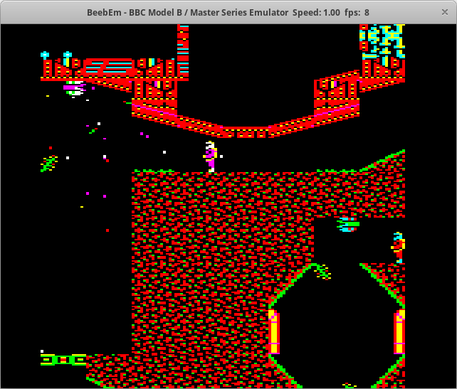

BeebEm for Linux
================

BeebEm is a BBC Micro and Master Series emulator. It enables you to run BBC Micro software on your PC. BeebEm was first developed for Unix systems in 1994 by [Dave Gilbert](http://www.treblig.org/) and was then ported to Microsoft Windows. This project brings BeebEm for Linux up to date with the latest BeebEm for Windows.

<p align="center">
  <a href="https://github.com/stardot/beebem-windows"></a>
</p>

The hardware emulated by BeebEm is that of a standard BBC Micro Model B, a Model B with IntegraB board, Model B Plus or Master 128. Optional 65C02 and other types of second processor are also emulated. The emulation is accurate enough to run most software.

For more information on how to use BeebEm, see the BeebEm help at Help/index.html.

Compiling
---------

The source code for BeebEm is available at https://github.com/chrisn/beebem-linux.

Install the following packages (note that these names my vary depending on which Linux distribution you're using):

* libgtk2.0-dev
* libsdl1.2-dev
* zlib1g-dev

```sh
mkdir build
cd build
cmake ..
make
```

Installing
----------

```sh
sudo make install
```

Credits
-------

Thanks to Dave Gilbert for originally creating BeebEm. There's an interview with Dave about the early development of BeebEm [on YouTube](https://www.youtube.com/watch?v=7D5Msu4zn-Q).

Thanks to Mike Wyatt for his contributions to BeebEm and for hosting the [BeebEm homepage](http://www.mkw.me.uk/beebem).

Thanks to David Eggleston for creating this BeebEm Linux port, and to Ben Collier, James Woodcock, and Steven Newbury for their updates.

Thanks to the maintainers and contributors for its continued development: Alistair Cree, Bill Carr, Charles Reilly, Chris Needham, David Sharp, Daniel Beardsmore, Dominic Beesley, Greg Cook, Jon Welch, Jonathan Harston, Ken Lowe, Kieran Mockford, Laurie Whiffen, Mark Usher, Martin Mather, Mauro Varischetti, Mike Wyatt, Nigel Magnay, pstnotpd, Rich Talbot-Watkins, Richard Broadhurst, Richard Gellman, Rob O'Donnell, Robert Schmidt, Steve Inglis, Steve Insley, Steve Pick, Tadek Kijkowski, Theo Lindebaum, Tom Seddon.

Copyright
---------

Copyright (C) 1994-2024 David Alan Gilbert and contributors.

License
-------

BeebEm is distributed under the terms of the GNU General Public License as described in [COPYRIGHT.txt](COPYRIGHT.txt).

